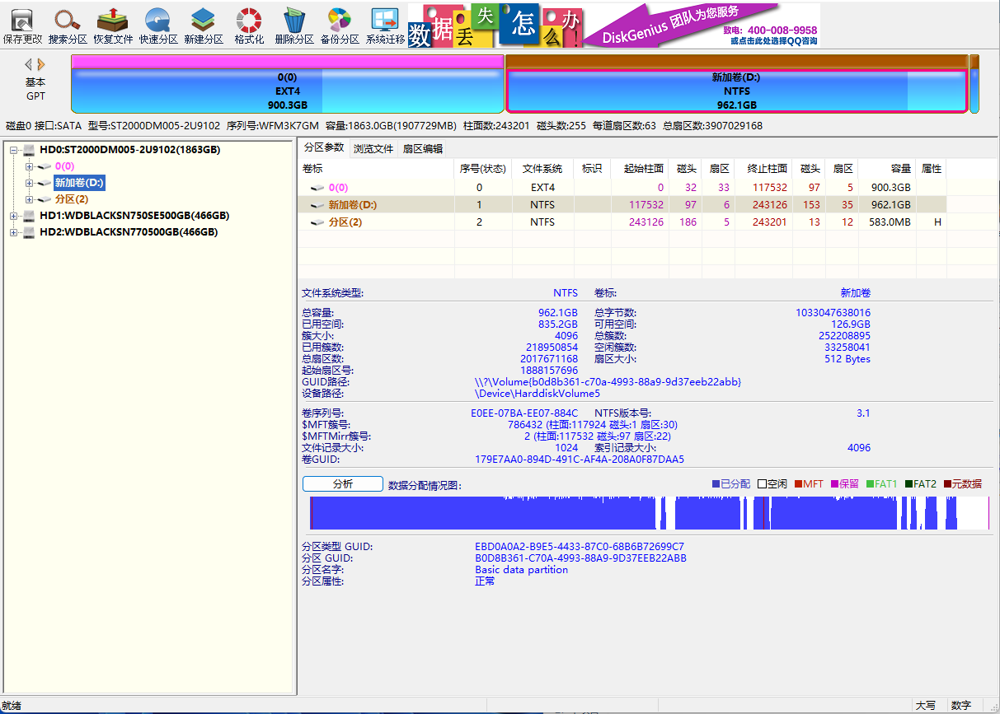
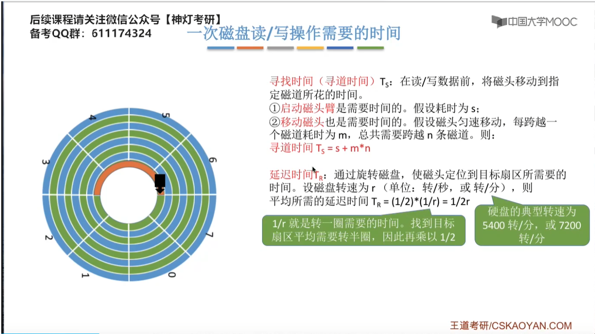
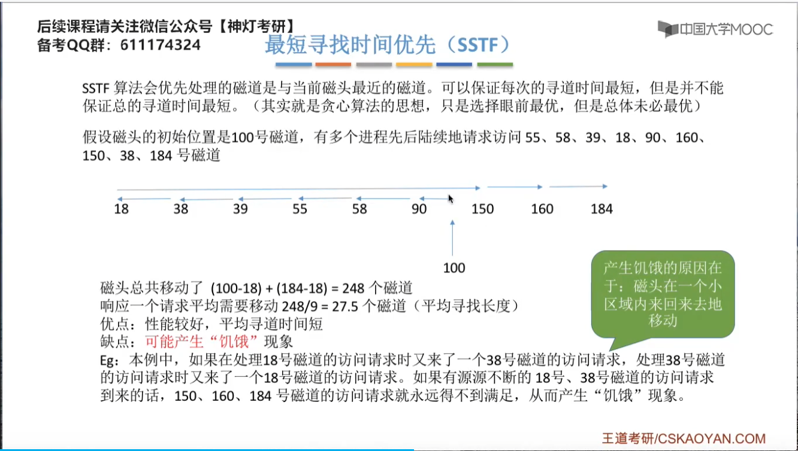

# 硬盘工作原理

# 磁盘的结构
## 磁盘、磁道、扇区

## 读取数据
磁场不变就是0，改变就是1

## 盘面、柱面、扇区 三元组组成物理地址
操作系统会指定柱面号、磁头号（或磁道号）和扇区号来精确地定位数据。

可以用（柱面号，盘面号，扇区号）来定位任意一个“磁盘块”

①根据“柱面号”移动磁臂，让磁头指向指定柱面;

②激活指定盘面对应的磁头;

③磁盘旋转的过程中，指定的扇区会从磁头下面划过,这样就完成了对指定扇区的读/写。

- 柱面号：选磁道
- 磁头号：选盘片
- 扇区号：选扇区

## 旋转方向和扇区号的关系
### 顺序访问
- 当磁盘旋转时，磁头会按照扇区号的顺序访问数据。如果磁头位于磁道的起始点，随着磁盘的旋转，磁头会依次经过编号为0、1、2...的扇区。

### 读写操作
- 磁盘的读写操作是顺序进行的，即磁头会按照扇区号的递增顺序来读取或写入数据。这是因为磁盘的旋转使得每个扇区依次到达磁头的位置。

### 寻道和等待
- 在磁盘操作中，磁头首先需要移动到正确的磁道上（寻道）。一旦磁头定位到正确的磁道，磁盘就会继续旋转，直到目标扇区到达磁头下方。这个过程称为"等待"或"旋转延迟"。

### 性能影响
- 磁盘的旋转速度（RPM）影响数据访问的速度。较高的RPM意味着磁盘旋转得更快，因此目标扇区到达磁头的速度也更快，从而减少了访问延迟。
### 磁盘容量
磁盘容量 = 磁头数x磁道(柱面)数x每道扇区数x每扇区字节数
- 磁头（head）数：每个盘片一般有上下两面，分别对应1个磁头，共2个磁头，因此，用哪个磁头就可以表示数据在哪个磁面；

- 磁道（track）数：磁道从盘片外圈往内圈编号0磁道，1磁道…，靠近主轴的同心圆用于停靠磁头，不存储数据；

- 柱面（cylinder）数：等于磁道数量，所有磁片中半径相同的同心磁道构成“柱面"，意思是这一系列的磁道垂直叠在一起，就形成一个柱面的形状。简单地理解，柱面就是磁道；

- 扇区（sector）数：每个磁道都被切分成很多扇形区域，每个磁道的扇区数量相同；
- 圆盘（platter）数：就是盘片的数量。 

### 例子
windows 系统的D盘

Linux 系统

用的是同一个2T 机械硬盘

## 磁盘的分类

## PMR分为两类
CMR是传统的，SMR是叠瓦式（特点是，由于工作方式决定缓存比较大）

## 机械硬盘选择

一定要购买CMR，而不是PMR含糊其词的描述

## 小结

# 磁盘调度算法

## 一次磁盘读/写操作时间

## 磁盘调度算法
由于磁盘的转速是固有属性，操作系统控制不了，操作系统可以优化的是寻道时间

## 原始磁盘

## 物理格式化

## 逻辑格式化
