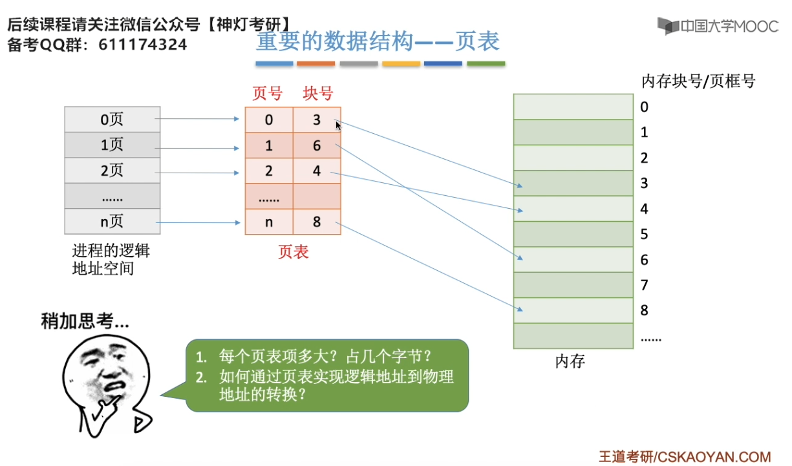
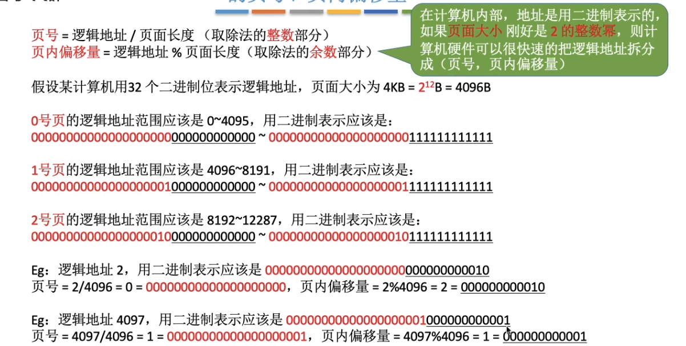

# 逻辑地址、线性地址和物理地址

- 逻辑地址（Logical Address）：也称为虚拟地址，是程序在编译时生成的地址。
逻辑地址是相对于程序的，每个程序都有自己的地址空间。如，c语言取指针的操作（&），这个值是逻辑地址，它是相对于你当前进程数据段的地址，不是物理地址。逻辑地址由两个16位的地址分量构成，一个为段基值，另一个为偏移量。两个分量均为无符号数编码。

- 线性地址（Linear Address）：也称为虚拟内存地址，是操作系统将逻辑地址转换后得到的地址。
线性地址存在于虚拟内存模型中，它是一个连续的地址空间。
线性地址最终会被转换为物理地址，这个过程通常由内存管理单元（MMU）完成。是一个32位无符号整数，可以用来表示高达4GB的地址，是逻辑地址和物理地址之间的中间层，在分段部件中，逻辑地址就是段中的偏移地址，加上基地址就是线性地址。

- 物理地址（Physical Address）：是实际存储在内存芯片上的地址。
物理地址直接对应于内存条上的存储单元。
当CPU访问内存时，最终是通过物理地址来定位数据的。

这三种地址之间的关系可以简单概括为：程序使用逻辑地址，操作系统将逻辑地址转换为线性地址，然后通过MMU将线性地址转换为物理地址，以便CPU能够访问实际的内存单元。这个过程涉及到内存管理的关键技术，如分页（Paging）和段式（Segmentation）内存管理。

## 小结

# 页框（Page Frame）
指的是物理内存中用于存储页面的固定大小的单元。在操作系统中，物理内存被划分为多个页框，每个页框的大小通常与虚拟内存中的页面大小相同，例如4KB。也叫内存块

页框是物理层的划分，页面是进程，逻辑层的划分
# 物理页
物理页（Physical Page）是计算机内存管理中的一个概念，它指的是物理内存中的一个固定大小的单元。在分页存储管理系统中，物理内存被划分成许多物理页，每个物理页通常与虚拟内存中的一个页面大小相同
# PCB

进程控制块（Process Control Block, PCB）是一个用于描述进程的内存管理结构
它包含了与进程相关的信息，如进程ID、进程状态、进程的物理地址、进程的调度信息等。

应当注意，`进程控制块PCB是一种数据结构`，这种数据结构不仅适用于进程，也适用于线程，也就是说线程也是使用类似PCB的数据结构来进行描述和调度的。

- 唯一身份标识（PID）,以一个简单不重复的整数，来代表进程的唯一标识符，用于区分不同的进程。系统会保证同一个机器上，同一时刻，每个进程的PID都是唯一的。

- 内存指针,进程在创建时，会先将指令和数据加载到内存中。而一组内存指针，则描述了进程使用内存资源的详细情况，包括使用的指令、数据等。

- 文件描述符表,存储器相关资源被操作系统封装成了文件。文件描述符表记录了进程打开的文件的描述符（文件相关性息），操作系统通过文件描述符可以访问打开的文件（访问存储器资源）。

- 状态,表示进程当前的运行状态，如就绪状态、阻塞状态等。

- 优先级,表示进程在同一时间内的优先级，优先级高的进程更有可能被调度执行。优先级可以通过系统api进行设置。

- 记账信息,记录进程的创建时间、开始时间、结束时间和运行时间等。系统会根据这个时间的统计结果调整进程调度的策略。

- 上下文,保存进程的CPU寄存器和内存管理信息，以便在进程暂停或重启时恢复。上下文是支持进程调度的重要属性。每个进程在运行过程中会有许多中间结果存储在CPU的寄存器中。因此在进程调度离开CPU之前，会把当前寄存器中的信息保存到内存中，这就是保存上下文

# 基本分页存在出管理

## 什么是分页存储

## 重要的数据结构--页表

### 每个页表项占用多少个字节

例子，

### 如何实现地址的转换

### 逻辑地址结构

## 小结

