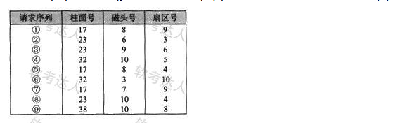
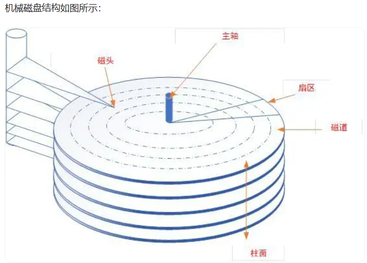

# VSCode搭建Markdown编辑环境

[VSCode搭建Markdown编辑环境](https://sunlogging.blog.csdn.net/article/details/139046567?spm=1001.2101.3001.6650.5&utm_medium=distribute.pc_relevant.none-task-blog-2%7Edefault%7EYuanLiJiHua%7EPosition-5-139046567-blog-133303401.235%5Ev43%5Epc_blog_bottom_relevance_base2&depth_1-utm_source=distribute.pc_relevant.none-task-blog-2%7Edefault%7EYuanLiJiHua%7EPosition-5-139046567-blog-133303401.235%5Ev43%5Epc_blog_bottom_relevance_base2&utm_relevant_index=8)

[使用vscode进行Markdown写作](https://blog.csdn.net/jiaxin576/article/details/138068092?spm=1001.2101.3001.6650.2&utm_medium=distribute.pc_relevant.none-task-blog-2%7Edefault%7EYuanLiJiHua%7ECtr-2-138068092-blog-139046567.235%5Ev43%5Epc_blog_bottom_relevance_base2&depth_1-utm_source=distribute.pc_relevant.none-task-blog-2%7Edefault%7EYuanLiJiHua%7ECtr-2-138068092-blog-139046567.235%5Ev43%5Epc_blog_bottom_relevance_base2&utm_relevant_index=5)

# 1、题

在磁盘调度管理中，应先进行移臂调度，再进行旋转调度。假设磁盘移动臂位于21号柱面上，进程的请求序列如下表所示。如果采用最短移臂调度算法，那么系统的响应序列应为（ ）。

A  ②⑧③④⑤①⑦⑥⑨
B  ②③⑧④⑥⑨①⑤⑦
C  ①②③④⑤⑥⑦⑧⑨
D  ②⑧③⑤⑦①④⑥⑨

试题答案
正确答案： D

答案解析
当进程请求读磁盘时，操作系统先进行移臂调度，再进行旋转调度。由于移动臂位于21号柱面上，按照最短寻道时间优先的响应柱面序列为23→17→32→38。

按照旋转调度的原则分析如下：
进程在23号柱面上的响应序列为②→⑧→③，因为进程访问的是不同磁道上不同编号的扇区(优先先旋转到扇区号小的，2的扇区号最小，其次是8，3)，旋转调度总是让首先到达读写磁头位置下的扇区先进行传送操作。
进程在17号柱面上的响应序列为⑤→⑦→①，或⑤→①→⑦。对于①和⑦可以任选一个进行读写，因为进程访问的是不同磁道上具有相同编号的扇区，旋转调度可以任选一个读写磁头位置下的扇区进行传送操作。
进程在32号柱面上的响应序列为④→⑥;由于⑨在38号柱面上，故最后响应。
从以上分析可以得出按照最短寻道时间优先的响应序列为②⑧③⑤⑦①④⑥⑨。

主轴是磁盘旋转的中心轴，磁头用于读写磁盘信息，一块硬盘有多层盘片，盘片每一面均有一个磁头。磁头前后移动，切换磁道。

将盘片逻辑的划分成很多个同心圆，用于存储数据，称为磁道。磁道由外至内从0依次编号。
所有盘片，同一磁道组成柱面。
以主轴为圆心，呈扇形，将磁道均匀分割成若干弧形小块，称之为扇区，是磁盘的最小存储单位。

磁盘旋转，到达指定扇区。
由题意，在磁盘调度时，先移动磁头，到达指定柱面，再旋转磁盘，找到扇区号。磁头是电子切换，不需要机械参与。
## 知识延申

[01WE.md](01/01.md)

# 2、题

某操作系统采用分页存储管理方式，下图给出了进程A和进程B的页表结构，如果物理页的大小为512字节，那么进程A逻辑地址为1111（十进制）的变量存放在（ ）号物理内存页中。假设进程A的逻辑页4与进程B的逻辑页5要共享物理页8,那么应该在进程A页表的逻辑页4和进程B页表的逻辑页5对应的物理页处分别填（ ）。

A 9

B 2

C 4

D 6

正确答案： C

答案解析
本题考查操作系统存储管理方面的基础知识。
物理页的大小为512字节，进程A逻辑地址为1111的变量的逻辑页号为2,对应的物理页号为4（页号 = 1111/512=2）。

## 知识延申
[01WE.md](02/02.md)